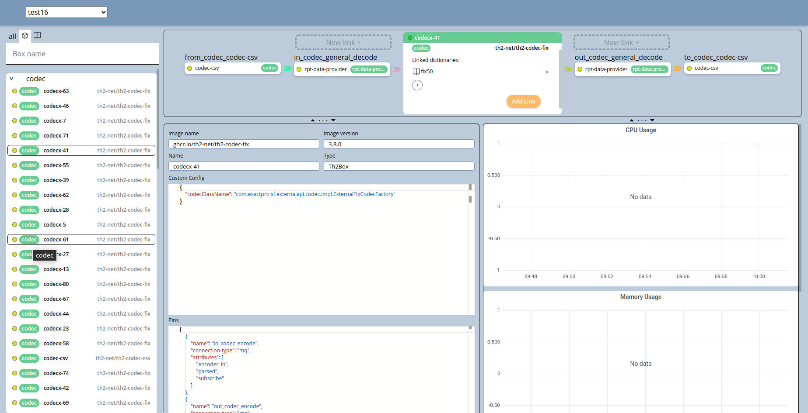

# Infra-editor


This is a web app that displays schemas, boxes and dictionaries and allows to edit them. 

# API
This app needs `th2-infra-mgr 1.5.2` backend component to function. It should be accessible at `{infra-editor-path}/backend/*`

# Configuration
To include this component in your schema, a following yml file needs to be created
```
apiVersion: th2.exactpro.com/v1
kind: Th2CoreBox
metadata:
  name: infra-editor
spec:
  image-name: ghcr.io/th2-net/th2-infra-editor-v2
  image-version: 2.0.14 // change this line if you want to use a newer version
  type: th2-infra-editor-v2
  extended-settings:
    chart-cfg:
      ref: schema-stable
      path: custom-component
    service:
      enabled: false
      targetPort: 80
      nodePort: '31276'
    resources:
      limits:
        memory: 15Mi
        cpu: 200m
      requests:
        memory: 10Mi
        cpu: 20m

```

# Screenshots

